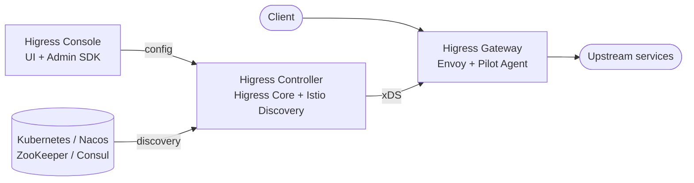

## What is Higress?

Higress is a cloud-native API gateway based on Istio and Envoy. It unifies AI gateway, API gateway, Kubernetes ingress controller, and microservice gateway capabilities into a single deployment. Wasm plugins written in Go, Rust, or JavaScript extend its behavior without restarts or traffic drops.

Higress was built inside Alibaba to replace Tengine, solving long-connection reload jitter and insufficient gRPC/Dubbo load balancing. It now powers Alibaba Cloud's AI gateway, supporting services such as the Tongyi Bailian model studio and the PAI machine learning platform, with a 99.99% high-availability guarantee.

## Core use cases

<CardGroup cols={2}>
  <Card title="AI gateway" icon="robot">
    Connect to all mainstream LLM providers with a unified protocol. Includes AI observability, multi-model load balancing, token-based rate limiting, and response caching.
  </Card>
  <Card title="MCP server hosting" icon="server">
    Host Model Context Protocol (MCP) servers through the plugin mechanism. Enables AI agents to call tools and services with unified auth, rate limiting, audit logs, and observability.
  </Card>
  <Card title="Kubernetes ingress controller" icon="cloud">
    Drop-in replacement for ingress-nginx with full annotation compatibility, Gateway API support, and ten times faster route propagation at significantly lower resource overhead.
  </Card>
  <Card title="Microservice gateway" icon="network-wired">
    Discover services from Nacos, ZooKeeper, Consul, Eureka, and DNS. Deep integration with Dubbo, Nacos, and Sentinel for the Java microservice ecosystem.
  </Card>
  <Card title="Security gateway" icon="shield-halved">
    WAF protection, IP/Cookie CC protection, and multiple authentication strategies: key-auth, hmac-auth, jwt-auth, basic-auth, and OIDC.
  </Card>
  <Card title="HTTP-to-RPC transcoding" icon="arrows-left-right">
    Expose RPC services (Dubbo, gRPC) as HTTP endpoints using declarative protocol conversion rules.
  </Card>
</CardGroup>

## Core advantages

**Production grade**

Born from Alibaba's internal infrastructure with over two years of production validation. Handles hundreds of thousands of requests per second. Eliminates traffic jitter caused by Nginx reload — configuration changes take effect in milliseconds with zero impact on in-flight connections. Particularly important for AI workloads that rely on long-lived streaming connections.

**Streaming processing**

Supports true end-to-end streaming of request and response bodies. Wasm plugins can intercept and transform streaming protocols such as Server-Sent Events (SSE) at the plugin layer without buffering the full response. In high-bandwidth AI scenarios this significantly reduces gateway memory usage.

**Easy to extend**

Ships with a rich official plugin library covering AI, traffic management, and security — meeting more than 90% of common business requirements out of the box. The Wasm plugin model provides memory-safe sandbox isolation, supports multiple languages (Go, Rust, JavaScript), allows independent plugin version upgrades, and achieves hot-reload of gateway logic with no connection loss.

**Secure and easy to use**

Implements the Kubernetes Ingress API and Gateway API standards. Provides an out-of-the-box UI console, WAF protection, and IP/Cookie CC protection. Supports automatic TLS certificate issuance and renewal via Let's Encrypt. Deployable outside Kubernetes with a single Docker command for local development.

## Architecture

Higress consists of three core components.

### Higress Controller

The control plane. It contains two sub-components:

- **Higress Core** — Watches Kubernetes Ingress, Gateway API, and Higress CRD resources. Translates them into Istio configuration and pushes updates to Discovery via the MCP-over-xDS protocol. Also manages the Cert Server for automatic TLS certificate provisioning.
- **Istio Discovery (Pilot)** — Aggregates configuration from Kubernetes, Gateway API, and Higress Core. Converts everything to xDS and streams it to the data plane over gRPC.

### Higress Gateway

The data plane. Contains Envoy and a Pilot Agent process. Pilot Agent starts and manages Envoy, and proxies xDS requests from Envoy to Discovery over a Unix Domain Socket. Envoy handles all request traffic, applying routing rules, load balancing, plugin logic, and TLS termination.

### Higress Console

The management UI and Admin SDK. Provides a visual interface for managing routes, domains, certificates, and plugins. The Admin SDK can also be used programmatically to integrate Higress configuration management into external systems.

## Key integrations

| Integration | Role |
|-------------|------|
| **Envoy** | Data plane proxy; handles all request traffic |
| **Istio** | Control plane foundation; xDS configuration distribution |
| **Kubernetes** | Native Ingress and Gateway API resource support |
| **Nacos** | Service discovery and configuration (Alibaba ecosystem) |
| **ZooKeeper / Consul / Eureka** | Additional service registry integrations |
| **Sentinel** | Flow control and circuit breaking for microservices |
| **Dubbo** | Protocol transcoding and service governance |
| **Let's Encrypt** | Automatic TLS certificate issuance and renewal |
| **Prometheus** | Metrics scraping via built-in Envoy stats endpoint |

## Next steps

<CardGroup cols={2}>
  <Card title="Quickstart" icon="rocket" href="/quickstart">
    Run Higress locally in under 5 minutes using Docker.
  </Card>
  <Card title="Installation" icon="download" href="/installation">
    Deploy to Kubernetes using Helm or the hgctl CLI.
  </Card>
</CardGroup>
